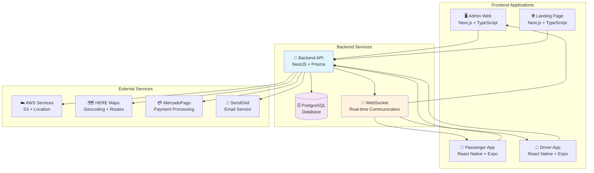
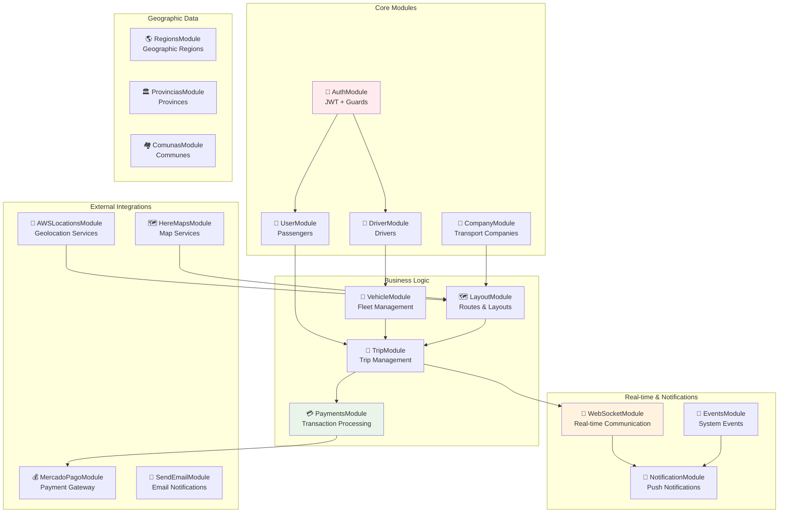
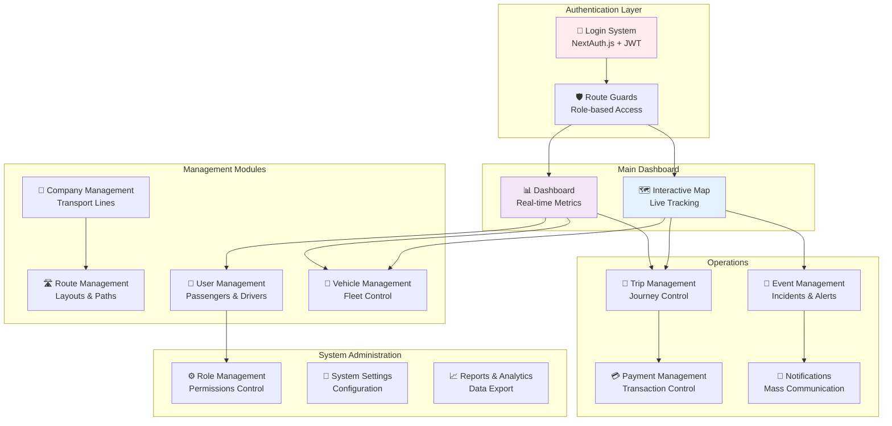
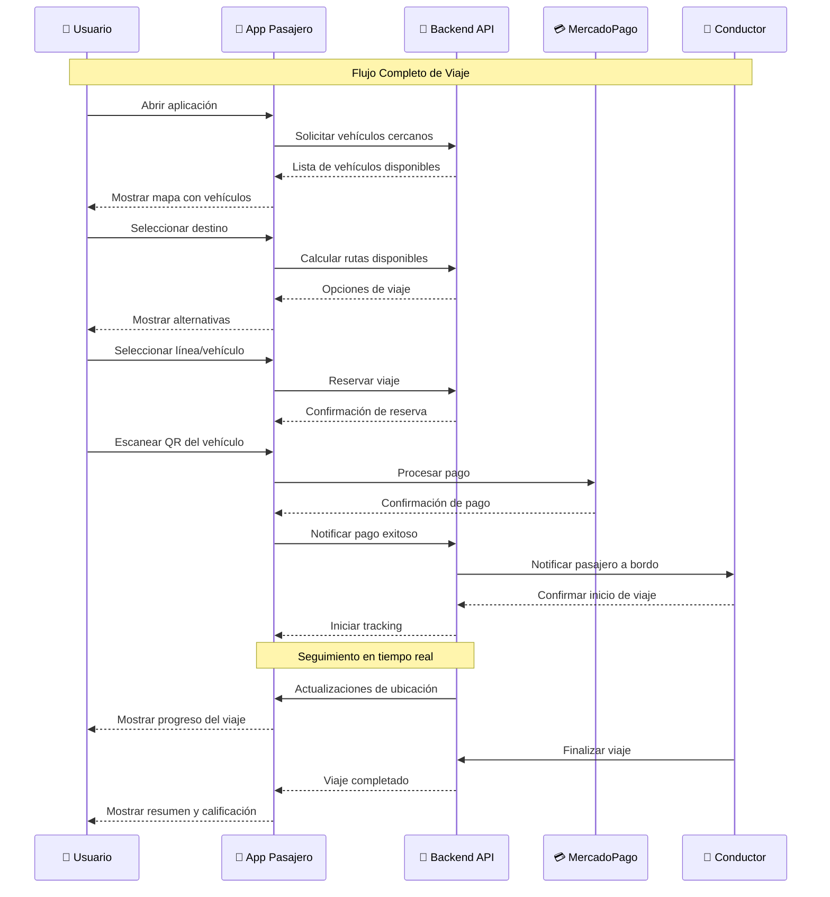
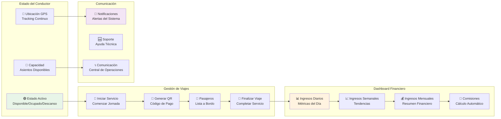
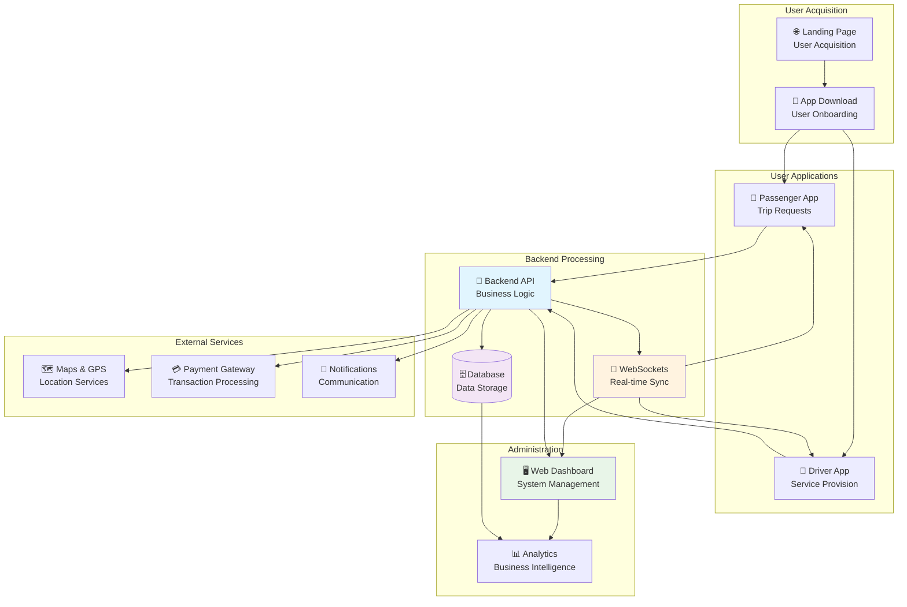
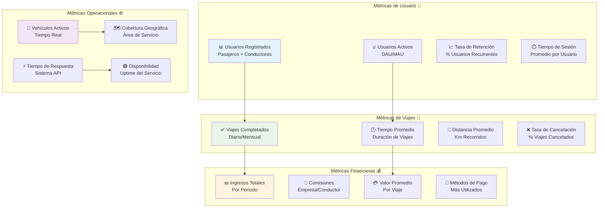

# Informe Detallado de Funcionalidades - Proyecto Colectyred

## Resumen Ejecutivo

Colectyred es una plataforma integral de transporte público que conecta pasajeros, conductores y administradores a través de múltiples aplicaciones interconectadas. El proyecto está compuesto por 5 módulos principales que trabajan en conjunto para ofrecer una solución completa de movilidad urbana.

---

## 📊 Arquitectura General del Sistema

### **Componentes Principales**
- **Backend API**: NestJS + Prisma + PostgreSQL
- **Frontend Web**: Next.js + TypeScript + Tailwind CSS
- **App Móvil Pasajero**: React Native + Expo
- **App Móvil Conductor**: React Native + Expo  
- **Landing Page**: Next.js + TypeScript + Tailwind CSS
- **Comunicación en Tiempo Real**: WebSockets (Socket.IO)
- **Mapas y Geolocalización**: AWS Location Services + HERE Maps
- **Pagos**: MercadoPago API

---

## 🔧 @colectyred-api/ (Backend)

### **Descripción General**

El backend de Colectyred es el núcleo del sistema, construido con NestJS siguiendo una arquitectura modular y escalable. Actúa como el cerebro central que coordina todas las operaciones del ecosistema, desde la autenticación de usuarios hasta el procesamiento de pagos y el tracking en tiempo real de vehículos.

Este API RESTful maneja la lógica de negocio completa del sistema de transporte público, incluyendo la gestión de usuarios (pasajeros y conductores), empresas de transporte, vehículos, rutas, viajes y pagos. Implementa un sistema robusto de autenticación y autorización basado en JWT con roles granulares, permitiendo diferentes niveles de acceso según el tipo de usuario.

La arquitectura del backend está diseñada para soportar miles de usuarios concurrentes, con comunicación en tiempo real a través de WebSockets para el tracking de vehículos y notificaciones instantáneas. Integra servicios externos como AWS Location Services para geolocalización, HERE Maps para cálculo de rutas, y MercadoPago para procesamiento de pagos seguros.

### **Tecnologías Principales**
- **Framework**: NestJS v9.0.0
- **Base de Datos**: PostgreSQL con Prisma ORM
- **Autenticación**: JWT + Guards personalizados
- **Documentación**: Swagger/OpenAPI
- **Comunicación**: WebSockets (Socket.IO)
- **Servicios Cloud**: AWS S3, SendGrid

### **Arquitectura de Módulos Backend**

### **Módulos y Funcionalidades**

#### 🔐 **Autenticación y Autorización**
- **AuthModule**: Login/logout, registro de usuarios
- **RolesModule**: Sistema de roles y permisos granulares
- **Guards**: AccessTokenGuard, RolesGuard para protección de rutas
- **Estrategias**: JWT con refresh tokens
- **Recuperación de contraseña**: Envío de emails con tokens seguros

#### 👥 **Gestión de Usuarios**
- **UserModule**: CRUD completo de usuarios (pasajeros)
- **DriverModule**: Gestión específica de conductores
- **Perfiles diferenciados**: Pasajeros, conductores, administradores
- **Validación de documentos**: RUT, licencias de conducir
- **Estados de usuario**: Activo, inactivo, pendiente de aprobación

#### 🚗 **Gestión de Vehículos**
- **VehicleModule**: Registro y gestión de vehículos
- **VehicleBrandModule**: Catálogo de marcas de vehículos
- **VehicleModelsModule**: Modelos por marca
- **Asociación conductor-vehículo**: Múltiples vehículos por conductor
- **Estados del vehículo**: Disponible, en servicio, fuera de servicio

#### 🏢 **Gestión de Empresas**
- **CompanyModule**: Administración de empresas de transporte
- **Líneas de transporte**: Gestión de rutas por empresa
- **Tarifas**: Configuración de precios por empresa/línea
- **Contactos**: Información de contacto por empresa

#### 🗺️ **Sistema de Rutas y Trazados**
- **LayoutModule**: Definición de rutas y trazados
- **TripRouteModule**: Gestión de rutas de viajes
- **Integración con mapas**: AWS Location Services + HERE Maps
- **Cálculo de distancias**: Algoritmos de optimización de rutas
- **Puntos de interés**: Paradas, terminales, puntos de referencia

#### 🚌 **Gestión de Viajes**
- **TripModule**: Creación y seguimiento de viajes
- **Estados de viaje**: Programado, en curso, finalizado, cancelado
- **Tracking en tiempo real**: Ubicación de vehículos y pasajeros
- **Capacidad de vehículos**: Control de ocupación
- **Historial de viajes**: Registro completo de actividad

#### 💳 **Sistema de Pagos**
- **PaymentsModule**: Procesamiento de pagos
- **MercadoPagoModule**: Integración completa con MercadoPago
- **MercadoPagoCardModule**: Gestión de tarjetas guardadas
- **MercadoPagoPaymentModule**: Procesamiento de transacciones
- **MercadoPagoCustomerModule**: Gestión de clientes en MP
- **Códigos QR**: Generación para pagos rápidos

#### 📍 **Servicios de Geolocalización**
- **AWSLocationsModule**: Integración con AWS Location Services
- **HereMapsModule**: Servicios de mapas y geocodificación
- **RegionsModule, ProvinciasModule, ComunasModule**: División territorial
- **Búsqueda de lugares**: Autocompletado de direcciones
- **Cálculo de rutas**: Optimización de trayectos

#### 🔔 **Sistema de Notificaciones**
- **NotificationModule**: Notificaciones push y en app
- **EventsModule**: Sistema de eventos del sistema
- **EventTypesModule**: Categorización de eventos
- **SendEmailModule**: Envío de emails transaccionales
- **Notificaciones en tiempo real**: WebSockets

#### 📊 **Dashboard y Reportes**
- **DashboardModule**: Métricas y estadísticas
- **Reportes de uso**: Análisis de viajes y usuarios
- **Métricas de rendimiento**: KPIs del sistema
- **Exportación de datos**: Formatos Excel/CSV

#### 🌐 **WebSockets y Tiempo Real**
- **GatewayModule**: Comunicación bidireccional
- **Tracking de vehículos**: Posición en tiempo real
- **Estados de conductores**: Disponible, ocupado, desconectado
- **Notificaciones instantáneas**: Alertas y mensajes
- **Sincronización de datos**: Actualizaciones automáticas

#### 📁 **Gestión de Archivos**
- **UploadModule**: Subida de archivos a AWS S3
- **Imágenes de perfil**: Usuarios y conductores
- **Documentos**: Licencias, permisos, certificados
- **Validación de archivos**: Tipos y tamaños permitidos

---

## 🖥️ @colectyred-web/ (Frontend Web - Panel Administrativo)

### **Descripción General**

La aplicación web de Colectyred es un completo panel administrativo diseñado para gestionar y monitorear todo el ecosistema de transporte público desde una interfaz web moderna y responsiva. Construida con Next.js 14 y TypeScript, ofrece una experiencia de usuario intuitiva para administradores, supervisores y personal operativo.

Esta plataforma web centraliza la administración del sistema, proporcionando dashboards interactivos con métricas en tiempo real, mapas dinámicos para el seguimiento de vehículos, y herramientas completas de gestión para usuarios, conductores, empresas, vehículos y rutas. El sistema implementa un control granular de permisos, permitiendo que diferentes roles accedan solo a las funcionalidades autorizadas.

Una de las características más destacadas es el mapa interactivo en tiempo real que muestra la posición de todos los vehículos activos, pasajeros en tránsito, eventos del sistema y heatmaps de actividad. Los administradores pueden monitorear el sistema completo, generar reportes detallados, gestionar incidencias y tomar decisiones operativas basadas en datos actualizados al instante.

La interfaz está optimizada para uso en escritorio y tablet, con un diseño responsivo que se adapta a diferentes tamaños de pantalla. Incluye herramientas avanzadas de filtrado, búsqueda y exportación de datos, facilitando la gestión eficiente de grandes volúmenes de información.

### **Tecnologías Principales**
- **Framework**: Next.js 14 con App Router
- **Lenguaje**: TypeScript
- **Estilos**: Tailwind CSS + Tremor React
- **Autenticación**: NextAuth.js
- **Estado**: React Query + Zustand
- **Mapas**: React Leaflet + Leaflet.heat
- **Tablas**: TanStack React Table
- **Formularios**: React Hook Form + Zod

### **Arquitectura Frontend Web**

### **Funcionalidades Principales**

#### 🔐 **Sistema de Autenticación**
- **Login seguro**: Validación con JWT
- **Recuperación de contraseña**: Flujo completo por email
- **Gestión de sesiones**: Auto-logout por inactividad
- **Roles y permisos**: Control granular de acceso

#### 📊 **Dashboard Principal**
- **Métricas en tiempo real**: Usuarios activos, viajes, ingresos
- **Gráficos interactivos**: Charts con Tremor React
- **Tarjetas de estadísticas**: KPIs principales
- **Filtros temporales**: Día, semana, mes, año
- **Exportación de reportes**: PDF y Excel

#### 🗺️ **Mapa Interactivo en Tiempo Real**
- **Visualización de vehículos**: Posición y estado en tiempo real
- **Tracking de pasajeros**: Ubicación durante viajes
- **Heatmap de actividad**: Zonas de mayor demanda
- **Eventos en mapa**: Incidentes, alertas, notificaciones
- **Filtros avanzados**: Por empresa, línea, estado
- **Simuladores**: Herramientas de testing para desarrollo
- **Rutas y trazados**: Visualización de recorridos

#### 👥 **Gestión de Usuarios**
- **Panel de usuarios**: Lista con filtros y búsqueda
- **Gestión de pasajeros**: CRUD completo
- **Gestión de conductores**: Validación de documentos
- **Estados de usuario**: Aprobación/rechazo de conductores
- **Perfiles detallados**: Información completa y historial

#### 🚗 **Administración de Vehículos**
- **Catálogo de vehículos**: Lista con imágenes y detalles
- **Gestión de marcas**: CRUD de marcas de vehículos
- **Gestión de modelos**: Modelos por marca
- **Asociaciones**: Vehículo-conductor-empresa
- **Estados**: Control de disponibilidad

#### 🏢 **Gestión de Empresas**
- **Panel de empresas**: Información y contactos
- **Configuración de tarifas**: Precios por línea/zona
- **Gestión de líneas**: Rutas y horarios
- **Reportes por empresa**: Estadísticas específicas

#### 🛣️ **Trazados y Rutas**
- **Editor de rutas**: Herramienta visual para crear trazados
- **Puntos de parada**: Definición de paradas y terminales
- **Validación de rutas**: Verificación de trazados
- **Importación/Exportación**: Formatos estándar

#### 🚌 **Gestión de Viajes**
- **Panel de viajes**: Estado y seguimiento
- **Historial completo**: Búsqueda y filtros avanzados
- **Métricas de viaje**: Duración, distancia, ocupación
- **Resolución de incidentes**: Gestión de problemas

#### 💳 **Administración de Pagos**
- **Panel de transacciones**: Historial de pagos
- **Conciliación**: Matching con MercadoPago
- **Reportes financieros**: Ingresos y comisiones
- **Gestión de reembolsos**: Proceso de devoluciones

#### 🔔 **Centro de Notificaciones**
- **Panel de notificaciones**: Envío masivo y segmentado
- **Plantillas**: Templates personalizables
- **Programación**: Notificaciones diferidas
- **Métricas**: Tasas de apertura y engagement

#### 📅 **Gestión de Eventos**
- **Calendario de eventos**: Incidentes y mantenimientos
- **Tipos de eventos**: Categorización y prioridades
- **Alertas automáticas**: Notificaciones por eventos críticos
- **Historial**: Registro completo de eventos

#### ⚙️ **Configuración del Sistema**
- **Gestión de roles**: Creación y edición de permisos
- **Configuración general**: Parámetros del sistema
- **Usuarios administrativos**: Gestión de accesos
- **Logs del sistema**: Auditoría y monitoreo

#### 📱 **Interfaz Responsiva**
- **Diseño adaptativo**: Optimizado para desktop y tablet
- **Navegación intuitiva**: Sidebar colapsible
- **Tema oscuro/claro**: Personalización visual
- **Accesibilidad**: Cumplimiento de estándares WCAG

---

## 📱 @colectyred-app/ (App Móvil - Pasajeros)

### **Descripción General**

La aplicación móvil para pasajeros de Colectyred es la interfaz principal que conecta a los usuarios con el sistema de transporte público de manera intuitiva y eficiente. Desarrollada con React Native y Expo, esta app está diseñada para proporcionar una experiencia de usuario fluida y moderna en dispositivos iOS y Android.

La aplicación se centra en simplificar el proceso de viajar en transporte público, permitiendo a los usuarios visualizar vehículos disponibles en tiempo real, planificar rutas óptimas, realizar pagos digitales seguros y hacer seguimiento de sus viajes. Su interfaz principal es un mapa interactivo que muestra la ubicación actual del usuario y todos los vehículos de transporte público cercanos con información detallada como capacidad disponible, tarifas y tiempos estimados de llegada.

Una característica distintiva es el sistema de pago por código QR, que permite a los pasajeros escanear un código en el vehículo y pagar instantáneamente con sus tarjetas guardadas, eliminando la necesidad de efectivo. La app también incluye funcionalidades sociales como compartir viajes, calificar servicios y acceder a promociones especiales.

El diseño está optimizado para uso con una sola mano, considerando que los usuarios frecuentemente la utilizan mientras están en movimiento o esperando transporte. Implementa notificaciones push para mantener a los usuarios informados sobre el estado de sus viajes y ofertas especiales.

### **Tecnologías Principales**
- **Framework**: React Native + Expo
- **Navegación**: Expo Router
- **Estado**: Zustand
- **Mapas**: React Native Maps
- **Formularios**: React Hook Form + Zod
- **Comunicación**: Socket.IO Client
- **Pagos**: MercadoPago SDK

### **Flujo de Usuario - App Pasajero**

### **Funcionalidades Principales**

#### 🔐 **Autenticación de Usuario**
- **Registro completo**: Datos personales y validación
- **Login seguro**: Autenticación con JWT
- **Recuperación de contraseña**: Por email y SMS
- **Validación de identidad**: RUT chileno
- **Términos y condiciones**: Aceptación obligatoria

#### 🗺️ **Mapa Principal e Interactivo**
- **Mapa en tiempo real**: Visualización de vehículos disponibles
- **Geolocalización**: Ubicación automática del usuario
- **Búsqueda de destinos**: Autocompletado con AWS Location
- **Rutas disponibles**: Múltiples opciones de viaje
- **Información de líneas**: Tarifas, horarios, contactos
- **Tracking en vivo**: Seguimiento de vehículo durante viaje

#### 🚌 **Sistema de Viajes**
- **Búsqueda origen-destino**: Planificador de rutas
- **Selección de línea**: Comparación de opciones
- **Reserva de asiento**: Indicación de capacidad
- **Seguimiento en tiempo real**: Ubicación del vehículo
- **Notificaciones de viaje**: Alertas de llegada y salida
- **Finalización de viaje**: Confirmación automática

#### 💳 **Sistema de Pagos**
- **Escaneo QR**: Pago rápido con código del vehículo
- **Tarjetas guardadas**: Gestión de métodos de pago
- **Integración MercadoPago**: Procesamiento seguro
- **Historial de pagos**: Registro de transacciones
- **Recibos digitales**: Comprobantes por email

#### 📍 **Gestión de Ubicaciones**
- **Lugares favoritos**: Guardado de direcciones frecuentes
- **Historial de lugares**: Búsquedas recientes
- **Compartir ubicación**: Envío de posición actual
- **Navegación**: Integración con apps de mapas

#### 🔔 **Notificaciones**
- **Push notifications**: Alertas en tiempo real
- **Centro de notificaciones**: Historial de mensajes
- **Configuración**: Personalización de alertas
- **Notificaciones de viaje**: Estados y actualizaciones

#### 📊 **Historial y Estadísticas**
- **Historial de viajes**: Registro completo de actividad
- **Estadísticas personales**: Métricas de uso
- **Gastos**: Resumen de pagos realizados
- **Rutas frecuentes**: Análisis de patrones

#### 🎁 **Promociones y Descuentos**
- **Códigos promocionales**: Aplicación de descuentos
- **Ofertas especiales**: Promociones por temporada
- **Programa de fidelidad**: Puntos y recompensas
- **Compartir promociones**: Referidos y bonificaciones

#### ⚙️ **Configuraciones**
- **Perfil de usuario**: Edición de datos personales
- **Métodos de pago**: Gestión de tarjetas
- **Preferencias**: Configuración de la app
- **Soporte**: Centro de ayuda y contacto
- **Términos y privacidad**: Documentos legales

#### 🔗 **Funciones Sociales**
- **Compartir viaje**: Envío de detalles por WhatsApp/SMS
- **Calificación**: Rating de conductores y servicio
- **Reportes**: Incidentes y problemas durante viajes

---

## 🚗 @colectyred-conductorapp/ (App Móvil - Conductores)

### **Descripción General**

La aplicación móvil para conductores de Colectyred es una herramienta profesional especializada que transforma la experiencia laboral de los conductores de transporte público. Desarrollada con React Native y Expo, esta aplicación está diseñada específicamente para las necesidades operativas y comerciales de los conductores profesionales.

Esta app funciona como el centro de control móvil para los conductores, permitiéndoles gestionar su jornada laboral de manera eficiente y profesional. Los conductores pueden iniciar y finalizar su servicio, controlar la capacidad de pasajeros, generar códigos QR para cobros, y monitorear sus ganancias en tiempo real. La aplicación también facilita la comunicación con la central de operaciones y otros conductores de la flota.

Una característica clave es el dashboard de ganancias integrado, que proporciona métricas detalladas sobre ingresos diarios, semanales y mensuales, incluyendo gráficos de rendimiento y análisis de patrones de trabajo. Esto permite a los conductores optimizar sus horarios y rutas para maximizar sus ingresos.

La app incluye funcionalidades de seguridad como tracking GPS continuo, botones de emergencia, y comunicación directa con soporte técnico. El diseño está optimizado para uso durante la conducción, con interfaces grandes y claras que minimizan las distracciones y priorizan la seguridad vial.

El sistema de validación y aprobación integrado asegura que solo conductores certificados y con documentación vigente puedan acceder a la plataforma, manteniendo altos estándares de calidad y seguridad en el servicio.

### **Tecnologías Principales**
- **Framework**: React Native + Expo
- **Navegación**: Expo Router
- **Estado**: Zustand
- **Mapas**: React Native Maps
- **Comunicación**: Socket.IO Client
- **Background Tasks**: Expo Task Manager

### **Dashboard de Conductor - Métricas y Control**

### **Funcionalidades Principales**

#### 🔐 **Autenticación de Conductor**
- **Registro especializado**: Datos profesionales y vehículo
- **Validación de documentos**: Licencia de conducir, permisos
- **Proceso de aprobación**: Verificación por administradores
- **Login con validación**: Autenticación segura
- **Recuperación de acceso**: Por email y teléfono

#### 🗺️ **Mapa de Conductor**
- **Posición en tiempo real**: Tracking GPS continuo
- **Visualización de pasajeros**: Usuarios esperando en ruta
- **Estado del conductor**: Disponible, ocupado, descanso
- **Rutas asignadas**: Trazados de líneas autorizadas
- **Eventos en mapa**: Incidentes, alertas, notificaciones

#### 🚌 **Gestión de Viajes**
- **Inicio/fin de servicio**: Control de jornada laboral
- **Capacidad del vehículo**: Configuración de asientos disponibles
- **Pasajeros a bordo**: Lista de usuarios en viaje
- **Cobro por QR**: Generación de códigos para pagos
- **Registro de paradas**: Control de subidas y bajadas

#### 💰 **Sistema de Ganancias**
- **Dashboard de ingresos**: Métricas diarias, semanales, mensuales
- **Gráficos de rendimiento**: Visualización de estadísticas
- **Historial de pagos**: Registro de transacciones recibidas
- **Liquidaciones**: Cálculo de comisiones y descuentos
- **Reportes**: Exportación de datos financieros

#### 📊 **Historial de Actividad**
- **Registro de viajes**: Historial completo de servicios
- **Métricas de conductor**: KPIs de rendimiento
- **Calificaciones**: Rating promedio de pasajeros
- **Incidentes**: Registro de problemas reportados
- **Estadísticas**: Análisis de patrones de trabajo

#### 🔔 **Centro de Notificaciones**
- **Alertas del sistema**: Notificaciones importantes
- **Solicitudes de viaje**: Requests de pasajeros
- **Actualizaciones**: Cambios en rutas o tarifas
- **Comunicación**: Mensajes de la empresa/administración

#### ⚙️ **Configuraciones de Conductor**
- **Perfil profesional**: Datos del conductor y vehículo
- **Configuración de servicio**: Horarios y disponibilidad
- **Métodos de cobro**: Integración con MercadoPago
- **Preferencias**: Configuración de la aplicación
- **Documentos**: Gestión de licencias y permisos

#### 🆘 **Soporte y Ayuda**
- **Centro de ayuda**: FAQs y guías
- **Contacto directo**: Chat o llamada con soporte
- **Reportes de problemas**: Sistema de tickets
- **Manuales**: Guías de uso de la aplicación

#### 🔗 **Funciones Adicionales**
- **Compartir información**: Datos de contacto y vehículo
- **Modo offline**: Funcionalidad básica sin conexión
- **Backup de datos**: Sincronización automática
- **Actualizaciones**: Sistema de updates automáticas

---

## 🌐 @colectyred-landing/ (Página Web Institucional)

### **Descripción General**

La página web institucional de Colectyred es la puerta de entrada digital que presenta la plataforma al público general, funcionando como el centro de información y captación de usuarios. Desarrollada con Next.js 14 y tecnologías web modernas, esta landing page combina un diseño atractivo con funcionalidad práctica para convertir visitantes en usuarios activos del sistema.

La página está estratégicamente diseñada para dos audiencias principales: pasajeros potenciales que buscan una mejor experiencia de transporte público, y conductores profesionales interesados en unirse a la plataforma. Cada segmento tiene secciones dedicadas que destacan los beneficios específicos y el valor propuesto para cada tipo de usuario.

La landing page utiliza técnicas avanzadas de UX/UI para guiar a los visitantes a través de un journey optimizado, desde el descubrimiento inicial hasta la descarga de las aplicaciones móviles. Incluye demostraciones interactivas de las funcionalidades principales, testimonios de usuarios reales, y un sistema de FAQ que responde las preguntas más comunes.

El diseño es completamente responsivo y está optimizado para SEO, asegurando una excelente visibilidad en motores de búsqueda y una experiencia consistente en todos los dispositivos. Las animaciones fluidas y los elementos interactivos, implementados con Framer Motion, crean una experiencia envolvente que refleja la innovación tecnológica de la plataforma.

La página también funciona como centro de soporte y documentación, proporcionando recursos para usuarios existentes y información detallada para potenciales socios comerciales o inversionistas interesados en la plataforma.

### **Tecnologías Principales**
- **Framework**: Next.js 14
- **Estilos**: Tailwind CSS
- **Animaciones**: Framer Motion
- **Componentes**: Headless UI
- **Optimización**: Sharp para imágenes

### **Secciones y Funcionalidades**

#### 🏠 **Página Principal**
- **Hero Section**: Presentación principal con call-to-action
- **Características principales**: 3 funcionalidades destacadas
  - **Visibilidad del Servicio**: Vehículos en tiempo real
  - **Funcionalidad Origen-Destino**: Planificador de rutas
  - **Pago Digital Rápido**: Sistema QR integrado
- **Características secundarias**: Beneficios adicionales
- **Call to Action**: Descarga de aplicaciones
- **Preguntas Frecuentes**: FAQ interactivo

#### 👨‍💼 **Página para Conductores** (`/conductores`)
- **Hero especializado**: Enfoque en conductores profesionales
- **Características para conductores**:
  - **Gestión de viajes**: Control total del servicio
  - **Dashboard de ganancias**: Métricas financieras
  - **Comunicación con flota**: Sistema integrado
- **Beneficios específicos**: Ventajas para conductores
- **Proceso de registro**: Pasos para unirse
- **Testimonios**: Experiencias de conductores reales
- **FAQ específico**: Preguntas de conductores

#### ℹ️ **Página Nosotros** (`/nosotros`)
- **Historia de la empresa**: Misión, visión, valores
- **Equipo**: Presentación del equipo fundador
- **Tecnología**: Explicación de la plataforma
- **Impacto social**: Beneficios para la comunidad

#### 🔐 **Sistema de Autenticación**
- **Login**: Acceso para usuarios registrados
- **Registro**: Formulario de alta de nuevos usuarios
- **Integración**: Conexión con el sistema principal

#### 📱 **Descarga de Apps**
- **Links de descarga**: App Store y Google Play
- **Códigos QR**: Descarga rápida por escaneo
- **Compatibilidad**: Información de dispositivos soportados

#### 🎨 **Diseño y UX**
- **Diseño responsivo**: Optimizado para todos los dispositivos
- **Animaciones fluidas**: Transiciones con Framer Motion
- **Carga optimizada**: Imágenes y assets optimizados
- **SEO optimizado**: Meta tags y estructura semántica
- **Accesibilidad**: Cumplimiento de estándares web

#### 📞 **Contacto y Soporte**
- **Información de contacto**: Teléfonos, emails, direcciones
- **Formulario de contacto**: Consultas directas
- **Soporte técnico**: Enlaces a centros de ayuda
- **Redes sociales**: Integración con plataformas sociales

---

## 🔗 Integración Entre Módulos

### **Flujo de Datos del Sistema Completo**

### **Flujo de Datos Detallado**
1. **Landing Page** → Captación de usuarios → **Apps Móviles**
2. **Apps Móviles** → Datos de uso → **Backend API**
3. **Backend API** → Procesamiento → **Frontend Web** (Dashboard)
4. **WebSockets** → Comunicación en tiempo real entre todos los módulos

### **Servicios Compartidos**
- **Autenticación**: JWT tokens válidos en todos los módulos
- **Base de datos**: Prisma ORM con PostgreSQL centralizada
- **Mapas**: AWS Location Services + HERE Maps
- **Pagos**: MercadoPago integrado en apps y web
- **Notificaciones**: Sistema unificado push/email/websocket
- **Archivos**: AWS S3 para almacenamiento centralizado

### **APIs y Comunicación**
- **REST API**: Endpoints documentados con Swagger
- **WebSockets**: Comunicación bidireccional en tiempo real
- **Webhooks**: Integración con servicios externos (MercadoPago)
- **GraphQL**: Consultas optimizadas para el frontend web

---

## 📈 Métricas y KPIs del Sistema

### **Dashboard de Métricas Principales**

### **KPIs Detallados por Categoría**

#### **Métricas de Usuario**
- Usuarios registrados (pasajeros/conductores)
- Usuarios activos diarios/mensuales
- Tasa de retención de usuarios
- Tiempo promedio de sesión

#### **Métricas de Viajes**
- Viajes completados por día/mes
- Tiempo promedio de viaje
- Distancia promedio recorrida
- Tasa de cancelación de viajes

#### **Métricas Financieras**
- Ingresos totales por período
- Comisiones por empresa/conductor
- Valor promedio por viaje
- Métodos de pago más utilizados

#### **Métricas Operacionales**
- Vehículos activos en tiempo real
- Cobertura geográfica
- Tiempo de respuesta del sistema
- Disponibilidad de servicios

---

## 🛡️ Seguridad y Cumplimiento

### **Seguridad de Datos**
- Encriptación de datos sensibles
- Tokens JWT con expiración
- Validación de entrada en todos los endpoints
- Rate limiting para prevenir ataques
- Logs de auditoría completos

### **Privacidad**
- Cumplimiento con leyes de protección de datos
- Consentimiento explícito para geolocalización
- Anonimización de datos analíticos
- Derecho al olvido implementado

### **Infraestructura**
- Despliegue en contenedores Docker
- Balanceadores de carga
- Backup automático de base de datos
- Monitoreo 24/7 con alertas

---

## 🚀 Tecnologías y Herramientas Utilizadas

### **Backend**
- NestJS, Prisma, PostgreSQL, JWT, WebSockets, Swagger

### **Frontend Web**
- Next.js, TypeScript, Tailwind CSS, React Query, Zustand, Leaflet

### **Mobile Apps**
- React Native, Expo, Zustand, React Native Maps, Socket.IO

### **Landing Page**
- Next.js, TypeScript, Tailwind CSS, Framer Motion, Headless UI

### **Servicios Externos**
- AWS (S3, Location Services), HERE Maps, MercadoPago, SendGrid

### **DevOps**
- Docker, Git, Husky, ESLint, Prettier, CI/CD

---

## 📋 Conclusiones

El proyecto Colectyred representa una solución integral y moderna para el transporte público, implementando las mejores prácticas de desarrollo y tecnologías de vanguardia. La arquitectura modular permite escalabilidad y mantenimiento eficiente, mientras que la integración entre todos los componentes garantiza una experiencia de usuario fluida y coherente.

### **Fortalezas del Sistema**
- Arquitectura escalable y modular
- Tecnologías modernas y actualizadas
- Comunicación en tiempo real
- Interfaz intuitiva y responsiva
- Sistema de pagos integrado
- Cobertura completa del flujo de transporte

### **Capacidades Técnicas**
- Manejo de miles de usuarios concurrentes
- Tracking GPS en tiempo real
- Procesamiento de pagos seguro
- Notificaciones push masivas
- Reportes y analytics avanzados
- Integración con servicios externos

Este informe documenta un ecosistema tecnológico robusto que posiciona a Colectyred como una plataforma líder en soluciones de movilidad urbana inteligente.
